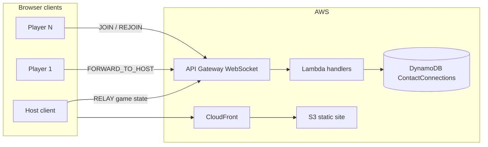
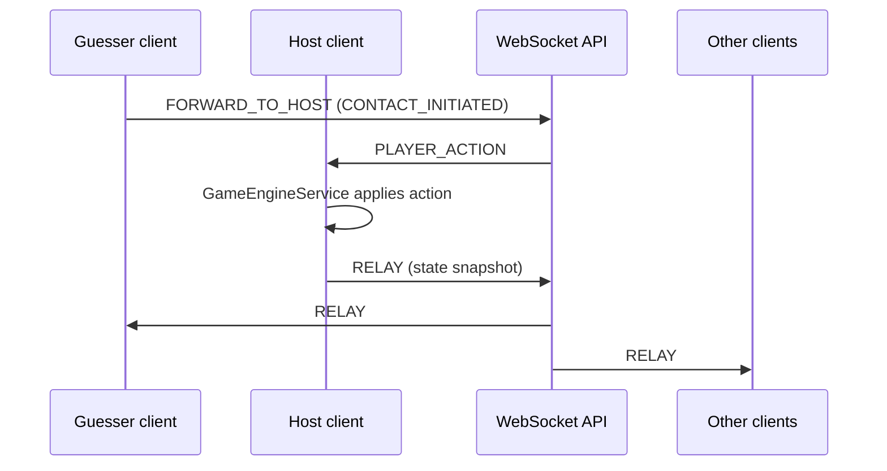

# Architecture

## High-level overview



| Layer | Responsibility |
|-------|----------------|
| **Angular frontend** | UI, local timers, **host-side game engine** |
| **WebSocket API + Lambda** | Connection lifecycle, room membership, broadcast routing |
| **DynamoDB** | `connectionId` ↔ room, nickname, host flag, approval status, rejoin slots |
| **S3 / CloudFront** | Static Angular build |

Game rules and `GameState` are **not** stored server-side. Only the host's client is authoritative during a session.

## Host-authoritative game state



### Roles

- **Room host** (`Player.isHost`, `GameState.hostId`): only connection allowed to send `RELAY`. Manages approvals and holds/can recover game state.
- **Clue Giver** (`GameState.clueGiverId`): game role; rotates each round. Often a different player than room host.

Non-host game actions:

1. Client calls `WebSocketService.send('FORWARD_TO_HOST', { actionType, ... })`
2. Lambda forwards `PLAYER_ACTION` to current room host connection
3. Host `GameEngineService.handlePlayerAction()` mutates state
4. Host `setStateAndRelay()` broadcasts redacted state to approved players

## WebSocket envelope

All messages use:

```typescript
interface WsEnvelope {
  action: string;
  payload: unknown;
  roomCode?: string;
  connectionId?: string;
}
```

See `shared/ws-types.ts` for full `ClientAction`, `ServerEvent`, and `RelayEventType` unions.

### Client → server actions (main)

| Action | Who | Purpose |
|--------|-----|---------|
| `CREATE_ROOM` | Anyone | Create room, become host |
| `JOIN_ROOM` | Anyone | Request to join (pending until approved) |
| `REJOIN_ROOM` | Returning player | Restore connection via rejoin slot |
| `APPROVE_PLAYER` / `REJECT_PLAYER` | Host | Lobby gatekeeping |
| `RELAY` | Host only | Broadcast game state |
| `FORWARD_TO_HOST` | Approved non-host | Game intents |
| `REQUEST_HOST_STATE` | New host after migration | Ask peers for state snapshot |
| `REQUEST_GAME_STATE` | Non-host on page load | Ask host for full/redacted state |
| `HOST_STATE_RESPONSE` / `GAME_STATE_RESPONSE` | Peers / host | State recovery |

### Server → client events (main)

| Event | Purpose |
|-------|---------|
| `ROOM_CREATED` / `JOIN_PENDING` / `JOIN_REJECTED` | Lobby flow |
| `PLAYER_APPROVED` / `PLAYER_REJECTED` | Membership updates |
| `RELAY` | Game state sync |
| `PLAYER_ACTION` | Host receives forwarded intents |
| `HOST_CHANGED` | Host disconnected; new host promoted |
| `REJOIN_OK` / `PLAYER_REJOINED` | Session restore |
| `GAME_STATE_RESPONSE` | Direct state to reconnecting client |

## DynamoDB model

Table: **`ContactConnections`** (see `infra/cdk/lib/contact-ws-stack.ts`)

- Partition key: `connectionId`
- GSI `RoomCodeIndex`: query all connections in a room
- TTL attribute: `ttl` (24h)

On **disconnect** (`disconnect.ts`):

1. Write **rejoin slot** (nickname → previous connection metadata)
2. Delete live connection record
3. If host: **promote next host** by join order and broadcast `HOST_CHANGED`
4. Else: broadcast `PLAYER_LEFT`

On **rejoin** (`REJOIN_ROOM` in `message.ts`):

1. Look up rejoin slot by room + nickname
2. Create new connection record; delete slot
3. Notify player (`REJOIN_OK`) and room (`PLAYER_REJOINED`)

## State recovery flows

### Page refresh (non-host)

1. `SessionService` loads `localStorage` session
2. `RoomService.tryRestoreSession()` → `REJOIN_ROOM`
3. `GameRoomComponent` calls `GameEngineService.requestGameState()`
4. Host responds with `GAME_STATE_RESPONSE` (secret word redacted for non–Clue Givers)

### Host migration

1. New host receives `HOST_CHANGED`
2. `GameEngineService.requestHostStateRecovery()` → `REQUEST_HOST_STATE`
3. Another client with state responds `HOST_STATE_RESPONSE`
4. New host relays `STATE_SYNC`

Fallback after 5s: host resets to `WORD_SETUP` (destructive — avoid in production debugging).

## Frontend service layering

```
Components (features/*)
    ↓
GameEngineService  ← game rules, timers, scoring (host only mutates + relays)
RoomService        ← lobby, approvals, session rejoin, invite URLs
WebSocketService   ← connection, send/onAction, reconnect backoff
SessionService     ← localStorage persistence
```

### State observables

`GameEngineService` exposes:

- `state$` — full `GameState`
- `overlay$` — transient UI overlays (`BLOCKED`, `SUCCESS`, `WORD_GUESSED`)
- `contactCount$` — contact countdown seconds
- `clueSeconds$` — clue input timer
- `clueInputOpen$` — clue modal visibility

## Relay payload redaction

Before broadcast, host removes ephemeral secrets from relay:

- `contactGuesses` and `blockGuess` stripped in `redactForBroadcast()`
- Full `secretWord` only visible to Clue Giver via `redactStateForPlayer()`

## Deployment pipeline

1. **GitHub Actions** (`.github/workflows/trigger-pipeline.yml`): on `main` push — test CDK, synth, build Angular; then OIDC → start CodePipeline
2. **CodeBuild** (`pipeline/buildspec.yml`):
   - Deploy CDK stack → capture `wss://` URL
   - Write `environment.prod.ts` with `wsUrl`
   - Build Angular → sync S3 → invalidate CloudFront

SSM parameters used: `/contact-game/prod/websocket_url`, `s3_bucket_name`, `cloudfront_distribution_id`.

## Infrastructure directories

| Path | Tool | Contents |
|------|------|----------|
| `infra/cdk/` | AWS CDK | WebSocket API, 3 Lambdas, DynamoDB |
| `infra/terraform/` | Terraform | S3 bucket, CloudFront distribution |

Terraform provisions static hosting; CDK provisions realtime backend. WebSocket URL is wired into the frontend at build time.

## Legacy / unused

- **`MATCH_VOTE` phase** and `CAST_VOTE` / `VOTE_FORWARD` — types and Lambda routing exist; **game engine does not use group vote**. Matches are resolved automatically when both contact words match.
- `voteDeadline`, `votes`, `canBlock` fields remain in `GameState` for historical/compatibility reasons; verify before building new features on them.
