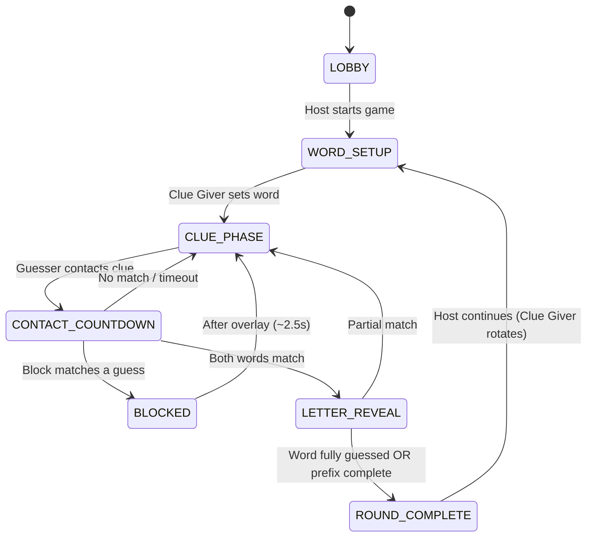

# Game rules and engine reference

Authoritative implementation: `frontend/contact-app/src/app/core/services/game-engine.service.ts`

## Player limits and validation

| Constant | Value |
|----------|-------|
| `MIN_PLAYERS` | 3 |
| `MAX_PLAYERS` | 12 |
| `SECRET_WORD_MIN` / `MAX` | 4–12 letters |
| Secret word charset | Unicode letters only (`/^\p{L}+$/u`) |
| Room code | 5 letters |

## Round flow (phases)



### LOBBY

- Host must approve joiners before they are `approved`.
- Game requires at least `MIN_PLAYERS` approved players to start.

### WORD_SETUP

- Current **Clue Giver** enters secret word (hidden from others).
- On submit: `revealedPrefix` = first letter; phase → `CLUE_PHASE`.

### CLUE_PHASE

- Clue Giver waits; **Guessers** (active in round) can:
  - **Create clue** — 45s personal timer (`CLUE_TIMER_SECONDS`); closes on submit
  - **Contact** an active clue they did not author
- Multiple clues can be on the board simultaneously.
- Clues with `usedWord` set (after a block) cannot be contacted again.

### CONTACT_COUNTDOWN

- Lasts up to **30s** (`CONTACT_COUNTDOWN_SECONDS`).
- **Early finish:** when **both** contact participants submit their word, host resolves immediately.
- Participants: contact initiator + clue author.
- Clue Giver may submit an optional **block word** (any time during countdown).
- Used match words cannot be submitted (`usedMatchWords` check).

### Resolution (`resolveContact`)

Inputs: `contactGuesses` (initiator + partner), optional `blockGuess`.

| Condition | Result |
|-----------|--------|
| Block word equals either contact word | **Blocked** — +15 Clue Giver; word added to `usedMatchWords`; clue gets `usedWord`; brief `BLOCKED` overlay |
| Both contact words equal (and word not already used) | **Match** |
| Match word === secret word | Round ends; +50 clue author, +25 initiator; `WORD_GUESSED` overlay |
| Match word ≠ secret word | +15 each; reveal next letter; word added to `usedMatchWords`; clues cleared |
| Otherwise | Return to `CLUE_PHASE` (no match) |

### LETTER_REVEAL

- Short overlay (`SUCCESS` or `WORD_GUESSED`), then continue or complete round.

### ROUND_COMPLETE

- Navigate to scoreboard route.
- Host manually starts next round (`continueToNextRound`):
  - Rotate `clueGiverId` to next approved active player by `joinOrder`
  - Reset word, clues, scores carry over, `usedMatchWords` cleared
  - All players set `activeInRound: true`

## Scoring constants

```typescript
CLUE_AUTHOR_POINTS = 50      // secret word guessed — clue author
CONTACT_INITIATOR_POINTS = 25 // secret word guessed — who called contact
CONTACT_MATCH_POINTS = 15     // partial match — each participant
BLOCK_POINTS = 15             // successful block — clue giver
```

Scores live in `GameState.scores` keyed by `connectionId`.

## Used words

`usedMatchWords: string[]` — words that matched on contact (partial) or were successfully blocked. Cannot be reused for contact guesses in the same round.

UI shows used words during `CLUE_PHASE` and `CONTACT_COUNTDOWN`.

Blocked clues also display the blocked word on the clue card (`ActiveClue.usedWord`).

## Mid-game join

When a player is approved while `phase !== 'LOBBY'`:

- Added to `state.players` with `activeInRound: false`
- They **spectate** until the next round (`continueToNextRound` sets everyone active)
- Host can approve from game room overlay
- Approved late joiner receives `GAME_STATE_RESPONSE` with redacted state

## Clue Giver rotation

After each round, `clueGiverId` advances circularly among approved players with `activeInRound !== false`, sorted by `joinOrder`.

First Clue Giver at game start: chosen **at random** among approved active players. Subsequent rounds rotate by `joinOrder`.

## UI overlays

`GameEngineService.overlay$` drives full-screen messages:

| Key | When |
|-----|------|
| `BLOCKED` | Successful block |
| `SUCCESS` | Partial match letter reveal |
| `WORD_GUESSED` | Secret word matched |

## i18n product names

| English | Portuguese (PT-BR) |
|---------|-------------------|
| Contact | Contato |
| Clue Giver | Criador de Senha |

In-game copy lives in `frontend/contact-app/src/assets/i18n/`. Home screen includes collapsible how-to-play aligned with these rules.

## Testing game changes manually

1. Run frontend locally with deployed or local `wsUrl`
2. Open 3+ browser tabs / devices
3. Create room → approve joiners → start game
4. Exercise: clue submit, contact match, partial match + used word, block + used clue, refresh/rejoin, mid-game join, host disconnect migration

When debugging state sync, watch **host browser console** and WebSocket `RELAY` payloads.
